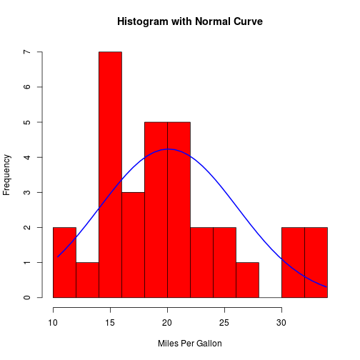
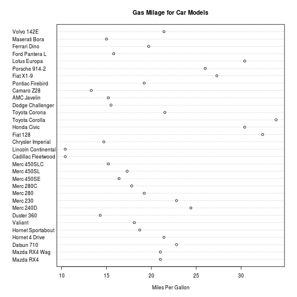
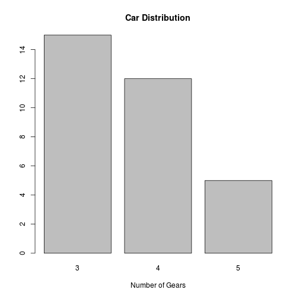
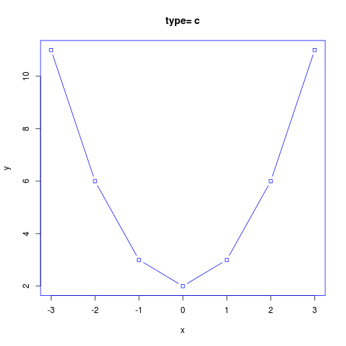
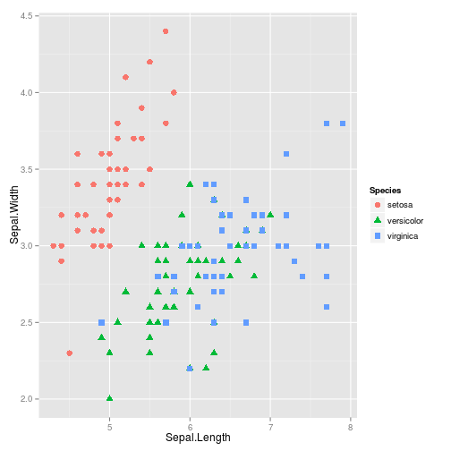

# Intro to R
### A brief introduction to R statistical environment

<small> Created by [Ankit Sharma](http://in.linkedin.com/in/aks11588/) / [Digg Data](http://diggdata.in) </small>

<script src="http://ajax.googleapis.com/ajax/libs/jquery/1.9.1/jquery.min.js"></script>

*** =pnotes

Some notes on the first slide

--- &vertical
### Basic operations
Addition, Subtraction, Multiplication, Division, Remainder


```r
1 + 3
```

```
## [1] 4
```

```r
4 * 2 - 5
```

```
## [1] 3
```

```r
42/23 + 43
```

```
## [1] 44.83
```


***

Creating a vector


```r
c(3, 2, 5, 1, 3, 5, 8, 9, 6, 3, 2)
```

```
##  [1] 3 2 5 1 3 5 8 9 6 3 2
```

```r
3:45
```

```
##  [1]  3  4  5  6  7  8  9 10 11 12 13 14 15 16 17 18 19 20 21 22 23 24 25
## [24] 26 27 28 29 30 31 32 33 34 35 36 37 38 39 40 41 42 43 44 45
```


***

Arithmatic operations on vectors


```r
c(1, 2, 3, 4) * c(10, 20, 30, 40)
```

```
## [1]  10  40  90 160
```


if two vectors are not of equal lengths 


```r
c(1, 2, 3, 4, 5) * c(10, 20, 30, 40)
```

```
## Warning: longer object length is not a multiple of shorter object length
```

```
## [1]  10  40  90 160  50
```


***

You can create a character vector as well

<small>_Note: You can using assignment operator '<-' to assign this vector to a variable name "mydata"_</small>


```r
mydata <- c("Hello world", "Data Science Practices", "Bangalore")
print(mydata)
```

```
## [1] "Hello world"            "Data Science Practices"
## [3] "Bangalore"
```

```r
mydata
```

```
## [1] "Hello world"            "Data Science Practices"
## [3] "Bangalore"
```


---
## Navigation within R environment

 - Listing all files
 

```r
ls()
```


 - Examining a variable
 

```r
str()  # Compactly display the internal structure of an R object
summary()  # Displays summary of the data like mean, median, 1st and 3rd quantile, number of NA(missing values)
head()  # Displays first 6 rows of the data
tail()  # Displays last 6 rows of the data
class()  # Displays class of object - character, integer, numeric, factor, logical
describe()  # part of HMisc package, basically a mixture of str() and summary()
```


 - Removing variables from environment
 

```r
rm()
rm(list = ls())  # Removes everything
```


--- &vertical
## Data Structures in R

1. Vectors:
  - Numeric
  - Character
  - Logical
  - Factors

2. Objects:
  - Arrays & Matrices
  - Lists
  - Data Frames

> **Data type conversion**

***

## Vectors


```r
x <- c(0, 2:4)
class(x)
```

```
## [1] "numeric"
```

```r
y <- c("alpha", "beta", "gamma", "32", "r2")
class(y)
```

```
## [1] "character"
```

```r
z <- as.logical(c(1, 0, TRUE, F, 1, T, FALSE))
class(z)
```

```
## [1] "logical"
```

```r
f <- as.ordered(factor(c("Good", "Normal", "Bad", "Good", "Bad", "Good", "Normal"), 
    levels = c("Bad", "Normal", "Good")))
class(f)
```

```
## [1] "ordered" "factor"
```

```r
str(f)
```

```
##  Ord.factor w/ 3 levels "Bad"<"Normal"<..: 3 2 1 3 1 3 2
```


***

 - Arrays


```r
myarray <- array(c(1, 2, 3, 4, 5, 6, 7, 8, 9, 10, 11, 12), dim = c(3, 4))
print(myarray)
```

```
##      [,1] [,2] [,3] [,4]
## [1,]    1    4    7   10
## [2,]    2    5    8   11
## [3,]    3    6    9   12
```


referencing a call


```r
myarray[2, 3]
```

```
## [1] 8
```


<small> To get all rows (or columns) from a dimension, simply omit the indices. The following code is for showing all columns of 2nd row </small>


```r
myarray[2, ]
```

```
## [1]  2  5  8 11
```


***

 - Matrices

<small> Well, matrix is nothing but a 2-dimensional array </small>


```r
matrix(data = c(1, 2, 3, 4, 5, 6, 7, 8, 9, 10, 11, 12), nrow = 3, ncol = 4)
```

```
##      [,1] [,2] [,3] [,4]
## [1,]    1    4    7   10
## [2,]    2    5    8   11
## [3,]    3    6    9   12
```

```r
data <- c(1, 2, 3, 4, 5, 6, 7, 8, 9, 10, 11, 12)
matrix(data, ncol = 3, byrow = F)  # Filling Column-wise
```

```
##      [,1] [,2] [,3]
## [1,]    1    5    9
## [2,]    2    6   10
## [3,]    3    7   11
## [4,]    4    8   12
```

```r
matrix(data, ncol = 3, byrow = T)  # Filling Row-wise
```

```
##      [,1] [,2] [,3]
## [1,]    1    2    3
## [2,]    4    5    6
## [3,]    7    8    9
## [4,]   10   11   12
```


***

 - Lists

<small>In R, it is possible to construct more complicated structures with multiple data types. R has a built-in data type for mixing objects of different types, called **lists**. </small>


```r
ndata = c(2, 3, 5)
sdata = c("aa", "bb", "cc", "dd", "ee")
ldata = c(TRUE, FALSE, TRUE, FALSE, FALSE)
mydata = list(ndata, sdata, ldata, 3)  # x contains copies of n, s, b
```


Referencing list


```r
mydata[2]
```

```
## [[1]]
## [1] "aa" "bb" "cc" "dd" "ee"
```

```r
mydata[c(1, 3)]
```

```
## [[1]]
## [1] 2 3 5
## 
## [[2]]
## [1]  TRUE FALSE  TRUE FALSE FALSE
```

```r
mydata[[1]][3]  # Member referencing
```

```
## [1] 5
```


***

 - Data Frames

<small> A data frame is used for storing data tables. It is a list of vectors of equal length. For example, the following variable df is a data frame containing three vectors a, b, c.</small> 


```r
a <- c(2, 3, 5)
b <- c("aa", "bb", "cc")
c <- c(TRUE, FALSE, TRUE)
df <- data.frame(a, b, c)
df
```

```
##   a  b     c
## 1 2 aa  TRUE
## 2 3 bb FALSE
## 3 5 cc  TRUE
```


<small>Built-in data frame like **iris**, **mcars**, **Insurance**, etc.</small>


```r
class(iris)
```

```
## [1] "data.frame"
```

```r
str(iris)
```

```
## 'data.frame':	150 obs. of  5 variables:
##  $ Sepal.Length: num  5.1 4.9 4.7 4.6 5 5.4 4.6 5 4.4 4.9 ...
##  $ Sepal.Width : num  3.5 3 3.2 3.1 3.6 3.9 3.4 3.4 2.9 3.1 ...
##  $ Petal.Length: num  1.4 1.4 1.3 1.5 1.4 1.7 1.4 1.5 1.4 1.5 ...
##  $ Petal.Width : num  0.2 0.2 0.2 0.2 0.2 0.4 0.3 0.2 0.2 0.1 ...
##  $ Species     : Factor w/ 3 levels "setosa","versicolor",..: 1 1 1 1 1 1 1 1 1 1 ...
```


***

## Data type conversion
Use is.foo to test for data type foo. Returns TRUE/FALSE<br/>
Use as.foo to explicitly convert it.
 
 - is.numeric(), is.character(), is.vector(), is.matrix(), is.data.frame()
 - as.numeric(), as.character(), as.vector(), as.matrix(), as.data.frame)


---&vertical

## Working with Data Frames

 - Manipulation
 - Indexing
 - Transform data

***
## Manipulation
Delecting a column

```r
data(iris)
dim(iris)
```

```
## [1] 150   5
```

```r
iris$Sepal.Width <- NULL  # or try iris[,2] <- NULL
dim(iris)
```

```
## [1] 150   4
```

Delecting a row

```r
data(iris)
dim(iris)
```

```
## [1] 150   4
```

```r
iris <- iris[-c(5:10), ]  # Removing the 5th-10th rows, total 6 rows
dim(iris)
```

```
## [1] 144   4
```


***

## Indexing
 1. array of integer indices
 2. array of character names
 3. array of logical booleans
 

```r
mydata <- list(bangalore = c(2, 3, 1, 4, 2), indore = c(7, 2, 4, 9, 8), noida = c(5, 
    2, 6, 8, 6))
mydata <- as.data.frame(mydata)
mydata[2:4, 1:2]  # integer indices
```

```
##   bangalore indore
## 2         3      2
## 3         1      4
## 4         4      9
```

```r
mydata[, "indore"]  # character indices
```

```
## [1] 7 2 4 9 8
```

```r
mydata[mydata$bangalore > 2, ]  # boolean logic
```

```
##   bangalore indore noida
## 2         3      2     2
## 4         4      9     8
```


***

## Transform data
Subset

```r
newdata <- subset(iris, Species == "setosa")
summary(newdata)
```

```
##   Sepal.Length   Petal.Length   Petal.Width          Species  
##  Min.   :4.30   Min.   :1.00   Min.   :0.100   setosa    :44  
##  1st Qu.:4.80   1st Qu.:1.38   1st Qu.:0.200   versicolor: 0  
##  Median :5.00   Median :1.50   Median :0.200   virginica : 0  
##  Mean   :5.02   Mean   :1.46   Mean   :0.248                  
##  3rd Qu.:5.20   3rd Qu.:1.60   3rd Qu.:0.300                  
##  Max.   :5.80   Max.   :1.90   Max.   :0.600
```


***
## Transform data (cond...)
Transform

```r
newdata <- transform(iris, ratio = Petal.Width/Petal.Length, Sepal.Length = NULL)
summary(newdata)
```

```
##   Petal.Length   Petal.Width          Species       ratio       
##  Min.   :1.00   Min.   :0.100   setosa    :44   Min.   :0.0667  
##  1st Qu.:1.60   1st Qu.:0.375   versicolor:50   1st Qu.:0.2308  
##  Median :4.40   Median :1.350   virginica :50   Median :0.3061  
##  Mean   :3.85   Mean   :1.240                   Mean   :0.2872  
##  3rd Qu.:5.10   3rd Qu.:1.800                   3rd Qu.:0.3586  
##  Max.   :6.90   Max.   :2.500                   Max.   :0.4706
```


***

## Transform data (cond...)
Sample

```r
mysample <- iris[sample(1:nrow(iris), 50, replace = FALSE), ]
summary(mysample)
```

```
##   Sepal.Length   Petal.Length   Petal.Width          Species  
##  Min.   :4.40   Min.   :1.00   Min.   :0.100   setosa    :14  
##  1st Qu.:5.10   1st Qu.:1.62   1st Qu.:0.375   versicolor:18  
##  Median :5.95   Median :4.50   Median :1.350   virginica :18  
##  Mean   :5.89   Mean   :3.89   Mean   :1.240                  
##  3rd Qu.:6.47   3rd Qu.:5.20   3rd Qu.:1.800                  
##  Max.   :7.90   Max.   :6.70   Max.   :2.300
```


---&vertical
## Control structures & Functions
R has the following control structures:

 1. if-else
 2. for
 3. while
 4. switch
 5. ifelse

***

**Functions**

R has lot of [Build-in functions](http://www.statmethods.net/management/functions.html) like mean(), tolower(), dnorm(), na.rm(), is.na(), t() for various analysis.<br/>
The general structure for any user-defined function in R is:


```r
myfunction <- function(arg1, arg2, ...) {
    statements
    return(object)
}
```


***

## Example
Transpose of a matrix


```r
mytrans <- function(x) {
    if (!is.matrix(x)) {
        warning("argument is not a matrix: returning NA")
        return(NA_real_)
    }
    y <- matrix(1, nrow = ncol(x), ncol = nrow(x))
    for (i in 1:nrow(x)) {
        for (j in 1:ncol(x)) {
            y[j, i] <- x[i, j]
        }
    }
    return(y)
}

# try it
z <- matrix(1:10, nrow = 5, ncol = 2)
tz <- mytrans(z)
tz
```

```
##      [,1] [,2] [,3] [,4] [,5]
## [1,]    1    2    3    4    5
## [2,]    6    7    8    9   10
```


---&vertical

## Working with data files

 - Getting data into R
 - Getting data out of R

***

## Getting data into R

 <small>- From data files (csv, tsv, txt, ...) 
 _Also look at read.delim, read.table functions_
 </small>

```r
mydata <- read.csv("/file path/file_name.csv", header = TRUE)
```


 <small>- From databases
packages require **sqldf**, **RSQLite**, **RSQLite.extfuns**, **gsubfn**, **DBI**, **chron**</small>

```r
connection <- dbConnect(driver, user, pass, host, dbname)
mydata <- dbSendQuery(connection, "SELECT * FROM table_name")
```


 <small>- From Web </small>

```r
connection <- url("http://www.example.com/datafile/data.txt")
mydata <- read.csv(connection, header = TRUE)
```


 <small>- From RData files</small>

```r
mydata <- data("Data_File_Name.Rdata")
```


***

## Getting data out of R

 <small>- To data files (csv, tsv, txt, ...)</small>

```r
write.csv("/file path/file_name.csv", header = TRUE, row.names = NULL)
```


 <small>- To databases </small>

```r
connection <- dbConnect(driver, user, pass, host, dbname)
dbWriteTable(connection, "table_name", data_name)
```


 <small>- To RData file
 </small>


```r
save(mydata, file = "mydata.RData")
```


---&vertical
## Data Processing

 1. Loading data into R
 2. Analyzing data
 3. Writing it out on a csv and RData file


***

## Loading data into R

```r
data(iris)
dim(iris)
```

```
## [1] 144   4
```

```r
head(iris)  #You can also do tails(iris) to get last 6 rows
```

```
##    Sepal.Length Petal.Length Petal.Width Species
## 1           5.1          1.4         0.2  setosa
## 2           4.9          1.4         0.2  setosa
## 3           4.7          1.3         0.2  setosa
## 4           4.6          1.5         0.2  setosa
## 11          5.4          1.5         0.2  setosa
## 12          4.8          1.6         0.2  setosa
```

```r
summary(iris)
```

```
##   Sepal.Length   Petal.Length   Petal.Width          Species  
##  Min.   :4.30   Min.   :1.00   Min.   :0.100   setosa    :44  
##  1st Qu.:5.17   1st Qu.:1.60   1st Qu.:0.375   versicolor:50  
##  Median :5.80   Median :4.40   Median :1.350   virginica :50  
##  Mean   :5.88   Mean   :3.85   Mean   :1.240                  
##  3rd Qu.:6.40   3rd Qu.:5.10   3rd Qu.:1.800                  
##  Max.   :7.90   Max.   :6.90   Max.   :2.500
```


***

## Analyzing data

```r
dim(iris)
```

```
## [1] 150   5
```

```r
head(iris)  #You can also do tails(iris) to get last 6 rows
```

```
##   Sepal.Length Sepal.Width Petal.Length Petal.Width Species
## 1          5.1         3.5          1.4         0.2  setosa
## 2          4.9         3.0          1.4         0.2  setosa
## 3          4.7         3.2          1.3         0.2  setosa
## 4          4.6         3.1          1.5         0.2  setosa
## 5          5.0         3.6          1.4         0.2  setosa
## 6          5.4         3.9          1.7         0.4  setosa
```

```r
summary(iris)  #You can also try str(iris) to show the compatibility display of objects
```

```
##   Sepal.Length   Sepal.Width    Petal.Length   Petal.Width 
##  Min.   :4.30   Min.   :2.00   Min.   :1.00   Min.   :0.1  
##  1st Qu.:5.10   1st Qu.:2.80   1st Qu.:1.60   1st Qu.:0.3  
##  Median :5.80   Median :3.00   Median :4.35   Median :1.3  
##  Mean   :5.84   Mean   :3.06   Mean   :3.76   Mean   :1.2  
##  3rd Qu.:6.40   3rd Qu.:3.30   3rd Qu.:5.10   3rd Qu.:1.8  
##  Max.   :7.90   Max.   :4.40   Max.   :6.90   Max.   :2.5  
##        Species  
##  setosa    :50  
##  versicolor:50  
##  virginica :50  
##                 
##                 
## 
```


***

## Writing it out a csv & RData

```r
write.csv("myIrisData", row.names = NULL)
save("iris", file = "myIrisRdata.RData")
```


Plotting some data


```r
plot(iris$Sepal.Length, xlab = "Index", ylab = "Length")
```

 


---&vertical
## Apply functions

<small>The following are the apply functions in the base package in R which should be used instead of loops.

 1. ***apply***             Apply Functions Over Array Margins
 2. ***by***                Apply a Function to a Data Frame Split by Factors
 3. ***eapply***            Apply a Function Over Values in an Environment
 4. ***lapply***            Apply a Function over a List or Vector
  - ***sapply***
  - ***vapply***
 5. ***mapply***            Apply a Function to Multiple List or Vector Arguments
 6. ***rapply***            Recursively Apply a Function to a List
 7. ***tapply***            Apply a Function Over a Ragged Array

</small>

***

## lapply


```r
# create a list with 2 elements
l <- list(a = 1:10, b = 11:20)
head(l)
```

```
## $a
##  [1]  1  2  3  4  5  6  7  8  9 10
## 
## $b
##  [1] 11 12 13 14 15 16 17 18 19 20
```

```r
# the mean of the values in each element
lapply(l, mean)
```

```
## $a
## [1] 5.5
## 
## $b
## [1] 15.5
```

```r
# the sum of the values in each element
lapply(l, sum)
```

```
## $a
## [1] 55
## 
## $b
## [1] 155
```


***

## Replicate


```r
replicate(5, rnorm(10))  # rnorm() is random generation for the normal distribution with mean equal to mean and standard deviation equal to sd.
```

```
##          [,1]     [,2]     [,3]     [,4]    [,5]
##  [1,] -0.3107  0.18165 -1.20096 -0.32282  0.6487
##  [2,] -0.5871 -0.31135  0.08768 -1.67377 -0.6564
##  [3,]  0.8028  0.03560  0.36174  0.05899  0.1640
##  [4,]  0.3906  1.06573  0.32263  0.35181 -0.1309
##  [5,] -0.9278 -0.06597 -2.36410  1.08502 -1.2519
##  [6,]  0.4756 -0.90339 -0.20174  0.07512 -0.2367
##  [7,]  1.3457 -0.37886 -1.00612  1.16226  0.6133
##  [8,]  0.4713  0.44807  2.65176 -1.65329  0.7477
##  [9,]  0.3419  1.82994  0.18421  0.77529  1.7285
## [10,]  2.3811 -0.37091 -0.68428  0.09878  0.2190
```

```r
replicate(10, "impetus")
```

```
##  [1] "impetus" "impetus" "impetus" "impetus" "impetus" "impetus" "impetus"
##  [8] "impetus" "impetus" "impetus"
```


---&vertical
## Graphics and Visualization

There are 3 major ways of creating graphics in R:
 1. Base R graphics
 2. [ggplot2 package](http://ggplot2.org/)
 3. [lattice package](http://lmdvr.r-forge.r-project.org/figures/figures.html)
 
Both "lattice" and "ggplot2" are based on grid graphics sub-system.<br/> A highly useful presentation for [building graphics in ggplot2](http://www.slideshare.net/izahn/rgraphics-12040991).

***

## Basic graphics in R

 - Density plot
 - Dot plot
 - Bar plot
 - Line plot
 - Pie plot
 - Box plot
 - Scatter plot

***

Density plot

```r
x <- mtcars$mpg
h <- hist(x, breaks = 10, col = "red", xlab = "Miles Per Gallon", main = "Histogram with Normal Curve")
xfit <- seq(min(x), max(x), length = 40)
yfit <- dnorm(xfit, mean = mean(x), sd = sd(x))
yfit <- yfit * diff(h$mids[1:2]) * length(x)
lines(xfit, yfit, col = "blue", lwd = 2)
```

 


***

Dot plot

```r
dotchart(mtcars$mpg, labels = row.names(mtcars), cex = 0.7, main = "Gas Milage for Car Models", 
    xlab = "Miles Per Gallon")
```

 


***

Bar plot

```r
counts <- table(mtcars$gear)
barplot(counts, main = "Car Distribution", xlab = "Number of Gears")
```

 


***

Line plot

```r
x <- c(-3:3)
y <- x^2 + 2  # create some data
par(pch = 22, col = "blue")  # plotting symbol and color 
opts = "c"
heading = paste("type=", opts)
plot(x, y, main = heading)
lines(x, y, type = opts)
```

 


***

Pie plot

```r
slices <- c(10, 12, 4, 16, 8)
lbls <- c("US", "UK", "Australia", "Germany", "France")
pct <- round(slices/sum(slices) * 100)
lbls <- paste(lbls, pct)  # add percents to labels 
lbls <- paste(lbls, "%", sep = "")  # ad % to labels 
pie(slices, labels = lbls, col = rainbow(length(lbls)), main = "Pie Chart of Countries")
```

 


***

Box plot

```r
boxplot(mpg ~ cyl, data = mtcars, main = "Car Milage Data", xlab = "Number of Cylinders", 
    ylab = "Miles Per Gallon")
```

 


***

Scatter plot

```r
attach(mtcars)
```

```
## The following object(s) are masked from 'mtcars (position 3)':
## 
##     am, carb, cyl, disp, drat, gear, hp, mpg, qsec, vs, wt
## The following object(s) are masked from 'mtcars (position 4)':
## 
##     am, carb, cyl, disp, drat, gear, hp, mpg, qsec, vs, wt
## The following object(s) are masked from 'mtcars (position 5)':
## 
##     am, carb, cyl, disp, drat, gear, hp, mpg, qsec, vs, wt
## The following object(s) are masked from 'mtcars (position 6)':
## 
##     am, carb, cyl, disp, drat, gear, hp, mpg, qsec, vs, wt
## The following object(s) are masked from 'mtcars (position 7)':
## 
##     am, carb, cyl, disp, drat, gear, hp, mpg, qsec, vs, wt
## The following object(s) are masked from 'mtcars (position 8)':
## 
##     am, carb, cyl, disp, drat, gear, hp, mpg, qsec, vs, wt
## The following object(s) are masked from 'mtcars (position 9)':
## 
##     am, carb, cyl, disp, drat, gear, hp, mpg, qsec, vs, wt
## The following object(s) are masked from 'mtcars (position 10)':
## 
##     am, carb, cyl, disp, drat, gear, hp, mpg, qsec, vs, wt
## The following object(s) are masked from 'mtcars (position 11)':
## 
##     am, carb, cyl, disp, drat, gear, hp, mpg, qsec, vs, wt
## The following object(s) are masked from 'mtcars (position 18)':
## 
##     am, carb, cyl, disp, drat, gear, hp, mpg, qsec, vs, wt
## The following object(s) are masked from 'mtcars (position 20)':
## 
##     am, carb, cyl, disp, drat, gear, hp, mpg, qsec, vs, wt
## The following object(s) are masked from 'package:ggplot2':
## 
##     mpg
```

```r
plot(wt, mpg, main = "Scatterplot Example", xlab = "Car Weight ", ylab = "Miles Per Gallon ", 
    pch = 19)
```

 


---
## "SQLDF" package - an intro

<small> 
_sqldf_ let's you perform SQL queries on your R data frames.
Install it using **install.packages("sqldf")**
</small>

<small> Goto [SQLite](http://www.sqlite.org/lang.html) for more querries. </small>


```r
library(sqldf)
movies <- data.frame(title = c("The Great Outdoors", "Caddyshack", "Fletch", 
    "Days of Thunder", "Crazy Heart"), year = c(1988, 1980, 1985, 1990, 2009))
boxoffice <- data.frame(title = c("The Great Outdoors", "Caddyshack", "Fletch", 
    "Days of Thunder", "Top Gun"), revenue = c(43455230, 39846344, 59600000, 
    157920733, 353816701))

sqldf("SELECT m.*, b.revenue FROM movies m INNER JOIN boxoffice b ON m.title = b.title;")
```

```
##                title year   revenue
## 1 The Great Outdoors 1988  43455230
## 2         Caddyshack 1980  39846344
## 3             Fletch 1985  59600000
## 4    Days of Thunder 1990 157920733
```


---

## "PLYR" package - an intro

<small> 

_plyr_ let's you perform **split, apply, combine** functionality in base R which reduces the computational time of your analysis by some extent.
 - Apply family of functions is the preferred way to call a function on each element of a list or vector. 
 - plyr gives you several functions 
   - **ddply, daply, dlply, adply, ldply**
   _ddply splits a data frame and returns a data frame (hence the dd)._

Install it using **install.packages("plyr")** & goto [A brief intro to "Apply" in R](http://nsaunders.wordpress.com/2010/08/20/a-brief-introduction-to-apply-in-r/#more-2058) for more examples. </small>


```r
library(plyr)
str(iris)
```

```
## 'data.frame':	150 obs. of  5 variables:
##  $ Sepal.Length: num  5.1 4.9 4.7 4.6 5 5.4 4.6 5 4.4 4.9 ...
##  $ Sepal.Width : num  3.5 3 3.2 3.1 3.6 3.9 3.4 3.4 2.9 3.1 ...
##  $ Petal.Length: num  1.4 1.4 1.3 1.5 1.4 1.7 1.4 1.5 1.4 1.5 ...
##  $ Petal.Width : num  0.2 0.2 0.2 0.2 0.2 0.4 0.3 0.2 0.2 0.1 ...
##  $ Species     : Factor w/ 3 levels "setosa","versicolor",..: 1 1 1 1 1 1 1 1 1 1 ...
```

```r
# split a data frame by Species, summarize it, then convert the results
# into a data frame
ddply(iris, .(Species), summarise, mean_petal_length = mean(Petal.Length))
```

```
##      Species mean_petal_length
## 1     setosa             1.462
## 2 versicolor             4.260
## 3  virginica             5.552
```


---

## "Stringr" package - an intro

<small> 
_stingr_ allows you to work on string data more effectively
Install it using **install.packages("stringr")**
</small>


```r
library(stringr)
names(iris)
```

```
## [1] "Sepal.Length" "Sepal.Width"  "Petal.Length" "Petal.Width" 
## [5] "Species"
```

```r
names(iris) <- str_replace_all(names(iris), "[.]", "_")
names(iris)
```

```
## [1] "Sepal_Length" "Sepal_Width"  "Petal_Length" "Petal_Width" 
## [5] "Species"
```

```r

s <- c("I am in India, I love Cricket, and I like Sachin.")
str_extract_all(s, "[l][a-z]+")
```

```
## [[1]]
## [1] "love" "like"
```

```r
str_split(s, ",")
```

```
## [[1]]
## [1] "I am in India"       " I love Cricket"     " and I like Sachin."
```


---&vertical

## "ggplot2" package - an intro

<small> 
Just like **English** language which has grammer, even visualization also has grammer and _ggplot2_ lets you create beautiful visualization using this grammer very easily<br/>
Install it using **install.packages("ggplot2")**
</small>


***

## ggplot2 example 1


```r
library(ggplot2)
# create factors with value labels
mtcars$gear <- factor(mtcars$gear, levels = c(3, 4, 5), labels = c("3gears", 
    "4gears", "5gears"))
mtcars$am <- factor(mtcars$am, levels = c(0, 1), labels = c("Automatic", "Manual"))
mtcars$cyl <- factor(mtcars$cyl, levels = c(4, 6, 8), labels = c("4cyl", "6cyl", 
    "8cyl"))
# Kernel density plots for mpg grouped by number of gears (indicated by
# color)
qplot(mpg, data = mtcars, geom = "density", fill = gear, alpha = I(0.5), main = "Distribution of Gas Milage", 
    xlab = "Miles Per Gallon", ylab = "Density")
```

 


***

## ggplot2 example 2: Plotting the iris data


```r
data(iris)
ggplot(iris, aes(Sepal.Length, Sepal.Width, color = Species)) + geom_point(aes(shape = Species), 
    size = 3)
```

 


---
## "qcc" package - an intro

<small>_qcc_ is a library for statistical quality control. <br/>
You can install it using **install.packages('qcc')**<br/>
The classic example is monitoring a machine that produces lug nuts. Let's say the machine is supposed to produce 2.5 inch long lug nuts. We measure a series of lug nuts: 2.48, 2.47, 2.51, 2.52, 2.54, 2.42, 2.52, 2.58, 2.51. Is the machine broken?
While you might not be monitoring physical machine, but qcc can help you monitor transaction volumes, visitors or logins on your website, database operations, and lots of other processes.</small>


```r
library(qcc)
# series of value w/ mean of 10 with a little random noise added in
x <- rep(10, 100) + rnorm(100)
# a test series w/ a mean of 11
new.x <- rep(11, 15) + rnorm(15)
# qcc will flag the new points
qcc(x, newdata = new.x, type = "xbar.one")
```

 

```
## List of 15
##  $ call        : language qcc(data = x, type = "xbar.one", newdata = new.x)
##  $ type        : chr "xbar.one"
##  $ data.name   : chr "x"
##  $ data        : num [1:100, 1] 10.63 9.01 7.88 7.98 10.67 ...
##   ..- attr(*, "dimnames")=List of 2
##  $ statistics  : Named num [1:100] 10.63 9.01 7.88 7.98 10.67 ...
##   ..- attr(*, "names")= chr [1:100] "1" "2" "3" "4" ...
##  $ sizes       : int [1:100] 1 1 1 1 1 1 1 1 1 1 ...
##  $ center      : num 10
##  $ std.dev     : num 1.09
##  $ newstats    : Named num [1:15] 11.1 11.1 10.2 10.6 11.7 ...
##   ..- attr(*, "names")= chr [1:15] "101" "102" "103" "104" ...
##  $ newdata     : num [1:15, 1] 11.1 11.1 10.2 10.6 11.7 ...
##  $ newsizes    : int [1:15] 1 1 1 1 1 1 1 1 1 1 ...
##  $ newdata.name: chr "new.x"
##  $ nsigmas     : num 3
##  $ limits      : num [1, 1:2] 6.73 13.26
##   ..- attr(*, "dimnames")=List of 2
##  $ violations  :List of 2
##  - attr(*, "class")= chr "qcc"
```


---&vertical

## "reshape2" package - an intro

<small> _reshape2_ lets you create beautiful visualization using this grammer very easily<br/>
Install it using **install.packages("reshape2")**
</small>


```r
library(reshape2)
# generate a unique id for each row; this let's us go back to wide format
# later
iris$id <- 1:nrow(iris)
iris.lng <- melt(iris, id = c("id", "Species"))
head(iris.lng)
```

```
##   id Species     variable value
## 1  1  setosa Sepal_Length   5.1
## 2  2  setosa Sepal_Length   4.9
## 3  3  setosa Sepal_Length   4.7
## 4  4  setosa Sepal_Length   4.6
## 5  5  setosa Sepal_Length   5.0
## 6  6  setosa Sepal_Length   5.4
```

```r
iris.wide <- dcast(iris.lng, id + Species ~ variable)
head(iris.wide)
```

```
##   id Species Sepal_Length Sepal_Width Petal_Length Petal_Width
## 1  1  setosa          5.1         3.5          1.4         0.2
## 2  2  setosa          4.9         3.0          1.4         0.2
## 3  3  setosa          4.7         3.2          1.3         0.2
## 4  4  setosa          4.6         3.1          1.5         0.2
## 5  5  setosa          5.0         3.6          1.4         0.2
## 6  6  setosa          5.4         3.9          1.7         0.4
```


You can use the **melt** function to convert wide data to long data, and **dcast** to go from long to wide.

***

Plotting the results using **ggplot2 package**


```r
library(ggplot2)
# plots a histogram for each numeric column in the dataset
p <- ggplot(aes(x = value, fill = Species), data = iris.lng)
p + geom_histogram() + facet_wrap(~variable, scales = "free")
```

 


---

## "BIGVIS" package - an intro

<small> The _bigvis_ package provides tools for exploratory data analysis of large datasets (10-100 million obs).<br/>
Install it by typing the following two commands in R terminal: 

 1. **install.packages("devtools")**
 2. **devtools::install_github("bigvis")**
 
</small>

---&vertical

## "random Forest" package - an intro

<small> The very famous _Random Forest_ machine learning algorithm which lets you create a classifier for predicting a class<br/>
Install it using **install.packages("randomForest")**
</small>


```r
library(randomForest)
# download Titanic Survivors data
data <- read.table("http://math.ucdenver.edu/RTutorial/titanic.txt", h = T, 
    sep = "\t")
# make survived into a yes/no
data$Survived <- as.factor(ifelse(data$Survived == 1, "yes", "no"))
# split into a training and test set
idx <- runif(nrow(data)) <= 0.75
data.train <- data[idx, ]
data.test <- data[-idx, ]
# train a random forest
rf <- randomForest(Survived ~ PClass + Age + Sex, data = data.train, importance = TRUE, 
    na.action = na.omit)
```


***

Random forest classifier results


```r
# how important is each variable in the model
imp <- importance(rf)
o <- order(imp[, 3], decreasing = T)
imp[o, ]
```

```
##           no   yes MeanDecreaseAccuracy MeanDecreaseGini
## Sex    47.52 52.16                52.00            68.40
## PClass 23.50 23.87                26.79            22.90
## Age    15.57 13.08                20.14            18.53
```

```r
# confusion matrix [[True Neg, False Pos], [False Neg, True Pos]]
table(data.test$Survived, predict(rf, data.test), dnn = list("actual", "predicted"))
```

```
##       predicted
## actual  no yes
##    no  424  19
##    yes 114 198
```


---

## [Thank you!!!]()
